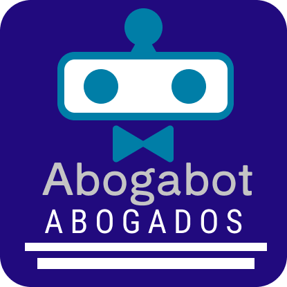

# Bienvenidos a Caso Abogabot 🤖💼. 
 
 ## Resumen del proyecto: 
Esta proyecto consta de una introdduccion a la programación web por parate Microsoft , Innovacion virual LaunchX a traves del diseño ux , ui de una compañia de abogados que necesitan tanto una pagina web como un sistema de desarrollo que les permita dar seguimiento a los casos de los clientes y que los clientes puedan registrarse en el sitio.
Me encargue de crear el logo, buyer persona, el diseño del sitio en ux y ui y por ultimo el flujod trabajo. (fue muy divertido hacer todo esto en una semana xd). 
- [Toma de requerimientos](1.-Reqierimientos.doc)
- [Buyer persona](Buyer_persona.pdf) 
- [Publico objetivo](https://miro.com/app/board/uXjVOJlztQg=/?invite_link_id=226487836902)
- [Wireframe Ux](https://www.figma.com/file/3x9j7TMwreiofD6AUVh52m/Caso-Abogabot?node-id=0%3A1)
- [UI](https://www.figma.com/file/3x9j7TMwreiofD6AUVh52m/Caso-Abogabot?node-id=0%3A1)
### Creditos:  
quisiera dejar esta seccion a las paginas web que me ayudaron a desarrollar este proyecto a manera de tributo por el materia o informacion dada en formato apa ("porque apa ?, R.- porque ya estoy traumado con ese formato .-.")

- Microsoft LaunchX ❤
- AS Abogados Monterrey. (2022). Asabogadosmonterrey.com. http://www.asabogadosmonterrey.com/?gclid=Cj0KCQiA3-yQBhD3ARIsAHuHT67XSoMrPuaX5FuIUoiaSjn4BNFQ_kRj6cplSvi-wwTz1Szk5ROPTHsaAv8TEALw_wcB

- Main Page. (2021). González Cortes Abogados. https://gonzalezcortesabogados.com/?gclid=Cj0KCQiA3-yQBhD3ARIsAHuHT64STBaxk7R1uF539DdWIgXR_ansQ_uTliJ6aoj3fAEVG4uagTHbNiEaAqQqEALw_wcB

- Vela G abogados. (2021, November 29). Vela G Abogados. https://abogadosvg.mx/?gclid=Cj0KCQiA3-yQBhD3ARIsAHuHT677IpFxyqHZF3S6LQJShdqCN8sBcOJv4diX6C81vvGRdeutwizkZBUaAo-GEALw_wcB

- Boxicons : Premium web friendly icons for free. (2022). Boxicons.com. https://boxicons.com/?query=

- Behance. (2022). Behance.net. https://www.behance.net/gallery/136067415/Unstudio-redesign-concept?tracking_source=search_projects%7Cwebsite

- Behance. (2022). Behance.net. https://www.behance.net/gallery/49527587/Wikipedia-Conceptual-Function?tracking_source=search_projects%7Cwikipedia
‌
‌

